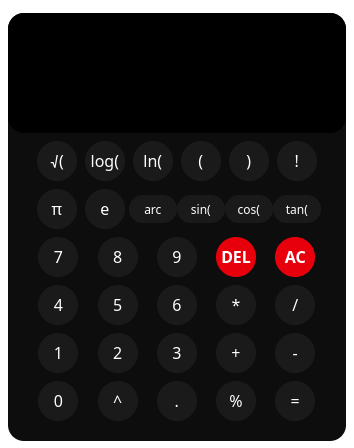

# Scientific Calculator

A scientific calculator web app built with React 19 and Vite, styled with Tailwind CSS 4. Expressions are evaluated with [mathjs](https://mathjs.org/).



## Features

- Basic arithmetic, parentheses, and exponentiation
- Square root, natural log, and log
- Factorial, π, and e
- Trigonometry: sin, cos, tan and their inverses
- Hyperbolic: sinh, cosh, tanh and their inverses
- DEL and AC controls

## Tech stack

- React 19, Vite 8
- Tailwind CSS 4 (via `@tailwindcss/vite`)
- mathjs 15 for expression evaluation
- ESLint + Prettier

## Scripts

```bash
npm run dev        # start dev server with HMR
npm run build      # production build to dist/
npm run preview    # preview the production build
npm run lint       # run ESLint
npm run format     # run Prettier
```

## Project structure

```
src/
  App.jsx                 # UI, state, and button handling
  calculations.js         # mathjs expression evaluator
  constants/constants.js  # button labels and values
  main.jsx                # React entry point
```
